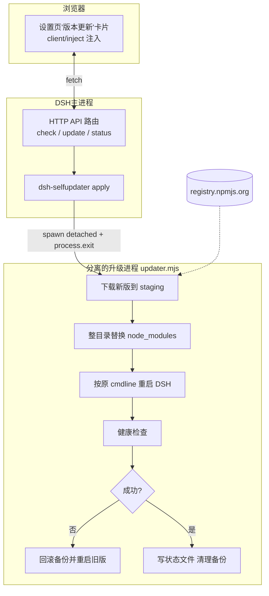
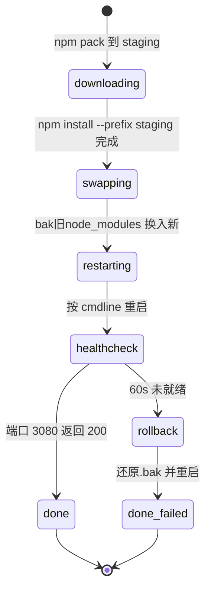

# DSH 主程序自更新插件（dsh-selfupdater）实施计划

## 1. 背景与目标

**痛点**：当前 FPK 安装包把 `@deepseek-ai/dsh` 固定打包进 `app.tgz`。DSH 上游每发一个新版，就必须重新跑一次构建并重新安装 FPK。

**目标**：开发一个 DSH 插件 `dsh-selfupdater`，让 DSH 主程序能**自我检测新版本并在线升级**。FPK 只需装一次，后续 DSH 升级全部由插件完成。

**交互形态**（用户已确认）：仿照 dshmarket，在 **Web 设置页注入一张"版本更新"卡片**，显示当前版本 / 最新版本，提供"检查更新""立即升级"按钮。

## 2. 现状分析（Phase 1 探索结论）

| 关键事实 | 来源 |
|---|---|
| DSH 安装于 `${APP_DIR}/node_modules/@deepseek-ai/dsh`，由 runner.js 以子进程方式拉起 | [runner.js](file:///c:/Users/Administrator/Desktop/deepseek/deepseek-harness/app/bin/runner.js) |
| 插件以 tgz 种子形式随包携带，首启时 `dsh plugin add` 装入 `${WORKSPACE}/.dsh/profiles/web/` | build.sh 步骤 3.5 |
| 内置插件清单由 `BUNDLED_DSH_PLUGINS=dshmarket` 控制 | [meta.env](file:///c:/Users/Administrator/Desktop/deepseek/scripts/meta.env) |
| build.sh 用 `npm pack <pkg>` 从 npm registry 拉种子 | build.sh 步骤 3.5 |
| dshmarket 形态参考：`package.json` 内声明 `dsh.bundle.patch`（服务端补丁）+ `dsh.client.inject`（浏览器端注入模块列表，platform=web），设置页卡片由此实现 | npm registry 抓包结果 |
| runner.js 已监听 SIGTERM/SIGINT/SIGHUP 优雅退出；cmd/main 有 stop/start 逻辑 | [cmd/main](file:///c:/Users/Administrator/Desktop/deepseek/deepseek-harness/cmd/main)、runner.js |
| NAS 运行时可访问 registry.npmjs.org（首启装插件已验证） | runner.js 首启流程 |
| Node 24 自带原生 fetch，插件无需额外依赖即可调 npm registry | NODE_VERSION=24.4.0 |

## 3. 方案总览

### 3.1 架构图



### 3.2 核心决策

1. **升级粒度 = 整个 `node_modules` 目录替换**，而不是只覆盖 dsh 单包。原因：新版 dsh 可能要求更新的 `@deepseek-ai/dsh-base` 等 peer 依赖，只换单包必然炸依赖树。
2. **升级动作放在独立的分离进程脚本 `updater.mjs`** 中执行，插件本体只负责"触发后退出"。原因：替换的是自己脚下的文件，必须先让 DSH 进程死掉才能安全换目录；分离进程用 `/proc/<pid>/cmdline` 抓取原始启动命令，重启后行为与 runner.js 直启完全一致。
3. **原子性保障**：staging 目录先装好 → 旧目录 rename 成 `.bak` → 新目录 rename 就位 → 失败则反向回滚。同分区 rename 是原子操作。
4. **本地插件源**：插件源码放仓库内 `plugins-src/dsh-selfupdater/`，build.sh 支持 `@local/` 前缀条目直接从仓库打包，**不发布 npm**，避免私有代码公开化。

## 4. 详细设计

### 4.1 新增文件（插件本体）

```
deepseek-harness/plugins-src/dsh-selfupdater/
├── package.json          # 声明 dsh.bundle.patch / dsh.client.inject（仿 dshmarket）
├── cordis.patch.yml      # 把插件追加进 Loader entries（仿 dshmarket 同名文件）
├── lib/
│   ├── index.js          # apply(ctx)：注册路由、读取状态、触发升级
│   └── updater.mjs       # 分离升级脚本：下载→换目录→重启→体检→回滚
└── client/
    └── settings-card.js  # 设置页卡片 UI（写法在实施时对照解包后的 dshmarket 客户端代码）
```

#### package.json 要点
```jsonc
{
  "name": "dsh-selfupdater",
  "version": "0.1.0",
  "type": "module",
  "main": "lib/index.js",
  "dsh": {
    "bundle": { "patch": "./cordis.patch.yml" },
    "client": {
      "inject": ["@deepseek-ai/dsh-client-ui-settings"],  // 具体列表以 dshmarket 解包结果为准
      "platform": "web"
    }
  }
}
```

#### lib/index.js 职责
- `apply(ctx)` 入口，注册三个 HTTP 接口：
  - `GET  .../selfupdater/status` → 读 `${WORKSPACE}/.dsh/selfupdate-status.json` + 当前安装版本，返回 `{current, latest, state, lastCheck, message}`
  - `POST .../selfupdater/check` → 原生 fetch 拉 `https://registry.npmjs.org/@deepseek-ai/dsh` 的 `dist-tags.latest`，做 semver 比较（自实现 ~30 行比较函数，含 prerelease 处理），写回状态文件
  - `POST .../selfupdater/perform` → 校验锁文件防并发 → spawn detached `updater.mjs --pid <process.pid>` → 本进程延时 `process.exit(0)`
- 版本定位：`require.resolve('@deepseek-ai/dsh/package.json')` 得到 APP_DIR 下真实路径，不硬编码
- 安全：接口鉴权方式**完全镜像 dshmarket 同类接口的做法**（其实施时从解包代码中确认；预期为复用宿主会话校验）

#### lib/updater.mjs 流程（状态机写入 selfupdate-status.json）



关键实现细节：
- 启动前从 `/proc/--pid/cmdline` 与 `/proc/--pid/cwd` 抓取 DSH 原始启动命令与工作目录
- 杀进程顺序：SIGTERM → 等 8s → SIGKILL（复刻 cmd/main 的策略）
- 重启用抓到的 cmdline 原样重放（`spawn(cmd, args, {cwd, detached:true, stdio:'ignore'}).unref()`）
- 健康检查轮询 `http://127.0.0.1:3080`，成功即删锁文件；失败还原 `node_modules.bak` 后再次重放启动
- 全程日志追加写 `${WORKSPACE}/.dsh/selfupdate.log`

#### client/settings-card.js 职责
- 在设置页"插件"区渲染卡片：当前版本徽标 / 最新版本徽标 / 「检查更新」「一键升级」按钮 / 进度文案（轮询 status 接口驱动）
- 升级进行中禁用按钮并显示阶段文案（downloading/swapping/restarting…）
- **注意**：该文件的具体挂载写法必须在实施第一步"解包 dshmarket"后照抄其模式，不允许凭空发明 API

### 4.2 修改的现有文件

| 文件 | 改动 | 原因 |
|---|---|---|
| [scripts/build.sh](file:///c:/Users/Administrator/Desktop/deepseek/scripts/build.sh) | 步骤 3.5 增加 `@local/` 前缀分支：`npm pack "${REPO_ROOT}/plugins-src/<name>"` | 私有插件不发布 npm 也能进种子 |
| [scripts/meta.env](file:///c:/Users/Administrator/Desktop/deepseek/scripts/meta.env) | `BUNDLED_DSH_PLUGINS=dshmarket @local/dsh-selfupdater` | 让 FPK 自带本插件 |

runner.js / cmd/main **不需要改动**：tgz 种子安装逻辑是通用的；重启由 updater.mjs 自己完成，不走 cmd/main。

## 5. 实施步骤清单

1. **解包侦察**：`npm pack dshmarket` 下载 tgz 解包，精读其 `lib/index.js`（路由注册 API）、`cordis.patch.yml` 格式、客户端卡片挂载方式、鉴权方式 —— 所有仿写以此为准绳
2. 创建 `plugins-src/dsh-selfupdater/` 全部五个文件
3. 改 build.sh 支持 `@local/` 条目；改 meta.env 加入插件
4. 本地静态自查（node --check 语法、JSON/YAML 合法性）
5. 提交推送 GitHub，等 CI 构建 FPK
6. 用户侧验证（见第 7 节）

## 6. 假设与决策记录

- **假设**：NAS 可稳定访问 registry.npmjs.org（已有首启装插件的成功事实支撑）
- **决策 A**：整目录换 `node_modules` 而非单包覆盖（依赖树完整性）
- **决策 B**：独立分离进程执行升级（自我替换的物理约束）
- **决策 C**：插件走仓库内 `@local/` 打包，不发 npm
- **决策 D**：UI 卡片的注入写法 100% 照搬 dshmarket 解包结果，不做创新；若 client 注入机制过于黑盒导致卡片无法落地，**降级方案**为插件自带一个独立 HTML 设置小页面并在卡片位置放跳转链接（仍满足"Web 操作升级"的核心诉求）
- **决策 E**：semver 比较自实现，不引第三方依赖，保持插件零依赖

## 7. 验证方案

1. CI 绿灯，产出双架构 FPK
2. NAS 安装 FPK，确认首启日志出现 `dsh-selfupdater` 装入 web profile
3. 浏览器打开设置页 → 出现"版本更新"卡片，显示当前版本
4. 点「检查更新」→ 正确返回 npm 最新版号
5. 点「一键升级」→ 服务自动重启 → 刷新页面版本号变为新版 → `selfupdate-status.json` 为 done
6. 回滚演练：人为把健康检查端口改错触发失败路径 → 确认自动还原旧版本且服务恢复

## 8. 风险与缓解

| 风险 | 缓解 |
|---|---|
| dshmarket 客户端注入机制黑盒，卡片可能难落地 | 决策 D 的降级方案兜底 |
| 升级中断电/断网变砖 | .bak 保留至下次成功升级才清理；下次启动若发现残留 staging/bak 自动恢复 |
| 新版 DSH 与 runner.js 不兼容（入口变更） | 健康检查失败自动回滚；manifest 中 DSH_FALLBACK_VERSION 仍可手动救砖 |
| 并发触发两次升级 | 锁文件 `.dsh/selfupdate.lock` 双端校验 |
